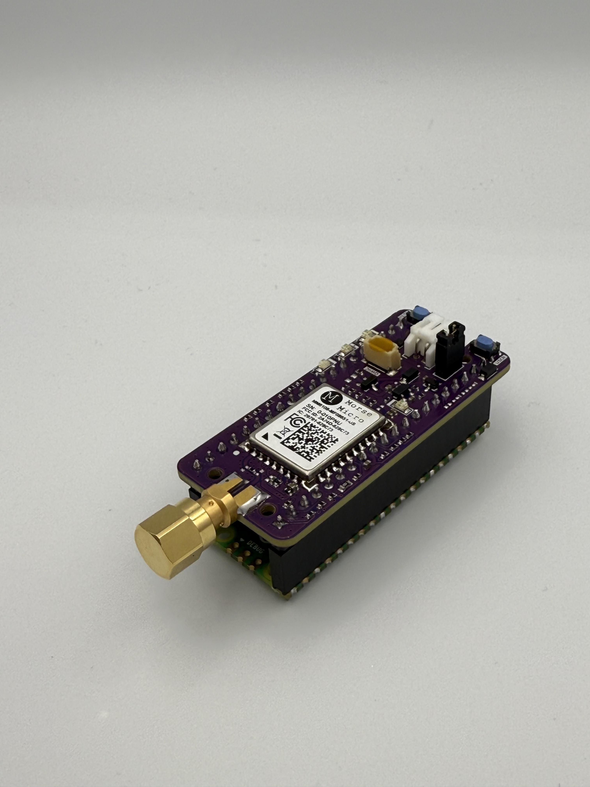
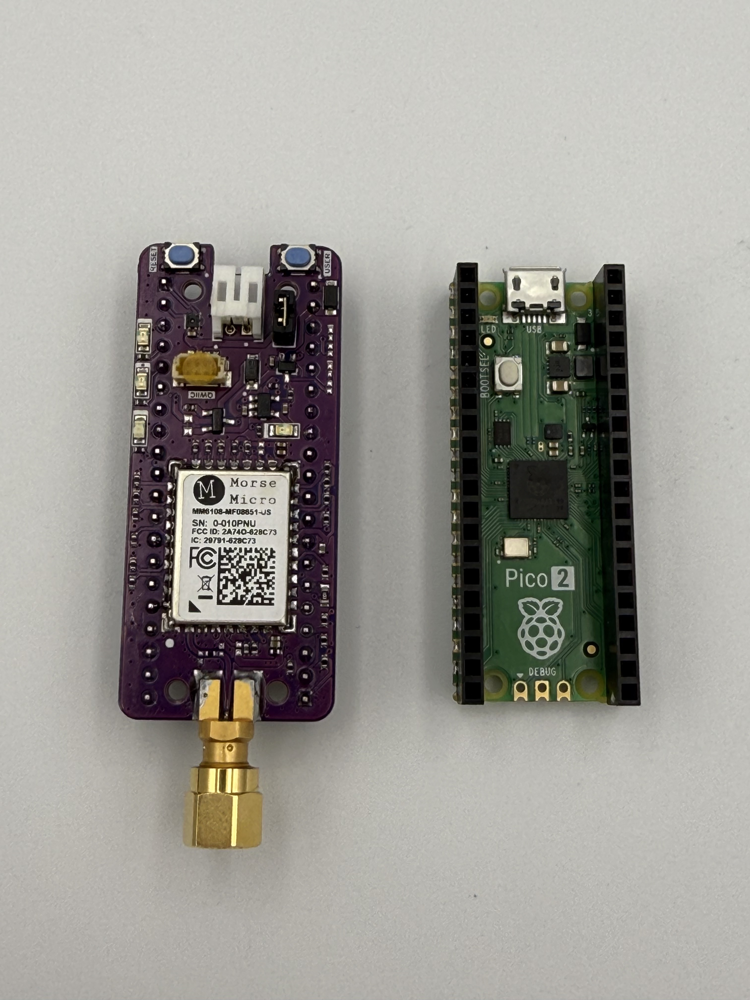
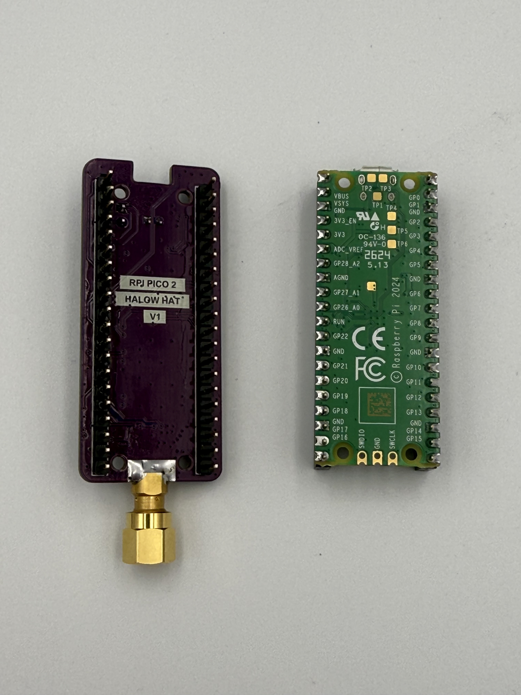
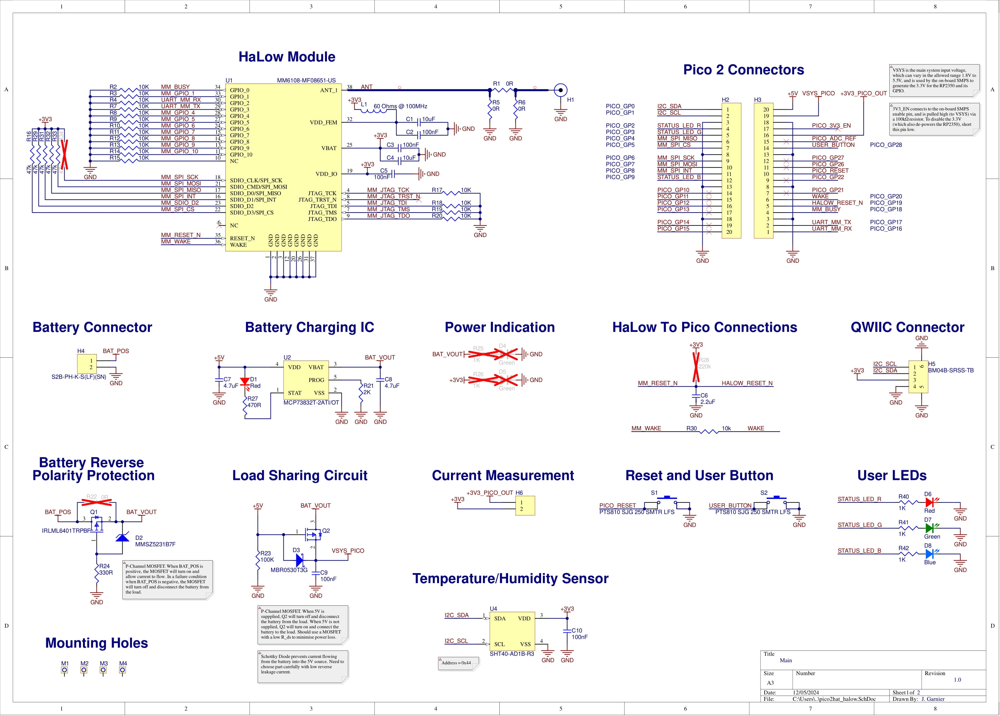

# HaLow Hat For RPI Pico 2

This repository contains design and output files for a Wi-Fi HaLow hat board for the RPI Pico 2. The board embeds a Morse Micro [MM6108-MF08651-US](https://au.mouser.com/ProductDetail/Morse-Micro/MM6108-MF08651-US?qs=mELouGlnn3dMCf9rE7Pbkw%3D%3D&utm_id=10897615195&gad_source=1&gclid=CjwKCAiAmMC6BhA6EiwAdN5iLS4QQk1tnmc2_u2mvFyQeB246rH6Dm1wwCiiVBR4xIAf0soErh3OAxoCEc0QAvD_BwE) Wi-Fi HaLow module, as well as a temperature and humidity sensor (SHT40), battery charging circuit, three LEDs, and a QWIIC connector for any other I2C based sensors. Other Wi-Fi HaLow modules with the same form factor will also be compatible, such as the Azurewave [AW-HM593](https://www.azurewave.com/wireless-modules-11ah.html).

## Images

## Fabrication Files
All files needed for fabrication are in the 'Project Outputs for rpi_pico_2_hat' folder. There is a 'Fabrication' folder for gerber and other manufacturing files, and a 'Assembly Default Variant of rpi_pico_2_hat' folder which has pick and place and BOM files.